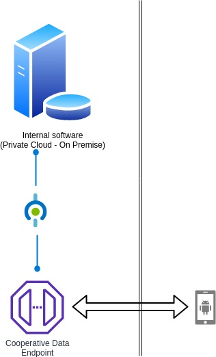

# NG Co-op

Document for New Generation Cooperatives.

## Internal Software

### Master Data

1. Master Instansi
2. Master Unit Kerja
3. Master Anggota
4. Master Jenis Simpanan
5. Master Jenis Pinjaman 

### Transaksi Jurnal 

1. Jurnal Umum
2. History 

### Jurnal Transaksi Simpanan

1. Pendaftaran Simpanan
2. Pendaftaran Simpanan Per Wilayah
3. Catat Simpanan Per Wilayah
4. Catat Setoran/Pengambilan
5. Catat Simpanan Per Petugas
6. Pemberian Bunga Simpanan
7. Cek Transaksi Simpanan 

### Transaksi Pinjaman

1. Pengajuan Pinjaman
2. Pendaftaran Pinjaman
3. Angsuran

### Transaksi Angsuran

1. Pencatatan Angsuran
2. Daftar Angsuran Bulanan

### SHU

1. Pembagian SHU
2. Pengambilan SHU
3. Daftar Pengambilan SHU

### Laporan

01. Laporan Rekap Simpanan
02. Laporan Rekap Transaksi Simpanan
03. Laporan Pendaftaran Simpanan
04. Laporan Pemberian Bunga
05. Laporan Pinjaman Total (Lunas/Belum Lunas)
06. Laporan Pinjaman Per Jenis Pinjaman
07. Laporan Pinjaman Per Anggota
08. Laporan Pinjaman Per Petugas
09. Laporan Angsuran Total
10. Laporan Angsuran Per Jenis Pembiayaan
11. Laporan Angsuran Per Anggota
12. Laporan Angsuran Per Petugas
13. Rekap Tagihan Bulanan
14. Daftar Akun/Rekening
15. Neraca Percobaan
16. Laporan Keuangan
17. Laporan Keuangan Harian
18. Laporan Buku Besar
19. Laporan Kas Harian
20. Laporan Sisa Hasil Usaha (SHU)

